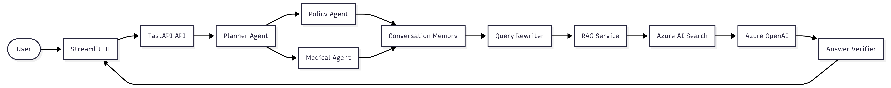

# Claims Agentic RAG

An enterprise-style Agentic Retrieval-Augmented Generation (RAG) application for insurance claims using Azure OpenAI, Azure AI Search, FastAPI, Streamlit, and Docker.

---

## Overview

This project demonstrates how modern AI applications can use multiple specialized agents to answer insurance policy questions with grounded, verifiable responses.

Instead of a single LLM call, the system orchestrates multiple AI components:

- Planner Agent
- Policy Agent
- Medical Agent
- Query Rewriter
- Conversation Memory
- Azure AI Search
- Azure OpenAI
- Answer Verification

---

## Architecture



---

## Features

- Multi-agent orchestration
- Retrieval-Augmented Generation (RAG)
- Azure AI Search Hybrid Search
- Azure OpenAI GPT
- Conversation Memory
- Query Rewriting
- Answer Verification
- Source Attribution
- FastAPI REST API
- Streamlit UI
- Docker Support

---

## Screenshots

### Home


---

### Ask Questions


---

### Conversation Memory


---

### Swagger API


---

## Tech Stack

- Python 3.13
- Azure OpenAI
- Azure AI Search
- FastAPI
- Streamlit
- Docker
- Pytest

---

## Project Structure

```text
Claims_Agentic_RAG
│
├── docs
├── src
│   ├── agents
│   ├── services
│   ├── infrastructure
│   ├── models
│   └── api.py
│
├── tests
│
├── app.py
├── Dockerfile
├── Dockerfile.streamlit
└── docker-compose.yml
```

---

## Running Locally

Install dependencies

```bash
pip install -r requirements.txt
```

Run FastAPI

```bash
uvicorn src.api:app --reload
```

Run Streamlit

```bash
streamlit run app.py
```

---

## Docker

Build

```bash
docker compose build
```

Run

```bash
docker compose up
```

---

## API

Interactive API documentation:

```
http://localhost:8000/docs
```

---

## Example Response

```json
{
  "planner": "POLICY",
  "answer": "The claims adjuster is J. Whitfield, Senior Claims Examiner.",
  "verified": true,
  "confidence": "HIGH",
  "sources": [
    {
      "source": "insurance_policy.pdf",
      "chunk_id": 2
    }
  ]
}
```

---

## Future Improvements

- Semantic caching
- Multi-document reasoning
- Azure Blob Storage ingestion
- Authentication
- Conversation persistence
- CI/CD with GitHub Actions
- Azure App Service deployment

---

## Testing

Run all tests

```bash
pytest
```

Current Status

- 8/8 tests passing

---

## License

MIT