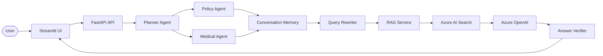

# Claims Agentic RAG Architecture

```mermaid
flowchart LR

User([User])

Streamlit[Streamlit UI]
FastAPI[FastAPI API]

Planner[Planner Agent]

Policy[Policy Agent]
Medical[Medical Agent]

Memory[Conversation Memory]
Rewrite[Query Rewriter]

RAG[RAG Service]

Search[Azure AI Search]

OpenAI[Azure OpenAI]

Verifier[Answer Verifier]

User --> Streamlit
Streamlit --> FastAPI

FastAPI --> Planner

Planner --> Policy
Planner --> Medical

Policy --> Memory
Medical --> Memory

Memory --> Rewrite

Rewrite --> RAG

RAG --> Search

Search --> OpenAI

OpenAI --> Verifier

Verifier --> Streamlit
```